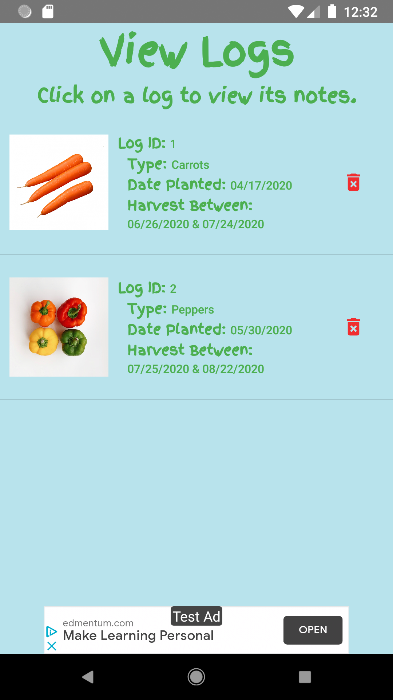

<h1>Planting made easy!</h1>

Plant/Crop Planning application based on Clyde's Garden Planner!

 

## Features

 

* Allows the user to look up general planting information (planting depth, harvest time, etc.) for a set of default plants
* Users have the ability to add and remove plants
	* Users can share and receive custom plants over Bluetooth from peers with the same app
* Create logs to keep track of planted plants
	* Add text, audio, and image notes to each log

 

## Application Images

   

## Links

* This Application's Specifications Documentation can be found [here](https://docs.google.com/document/d/1s-XwBKtrc03HqLFiqbofNUjdgzlbqzlyzPURGRhQImM/edit?usp=sharing)
* Plannter's Video Demo can be found [here](https://drive.google.com/file/d/1vvfwNfplSy3sSANlWKwMxv80k2_ai1FV/view?usp=sharing) (Narrated by Rachel Rettig)

 
 
 

## Configuration

Defaults for harvesting and planting range for each crop are set based off of the most recent first spring frost date and the last fall frost date. All plants in the database are from the Clyde’s Garden Planner slider sheet used for reference for making this app. All new plants and their corresponding information may be added in the Crop Info page. All frost dates may be changed in the settings menu, and those changes will then affect the planting and harvesting range for all crops in the database. You may remove individual plants via their corresponding page in Crop Info. You may also reset the database to its original plant values in the Settings page. No other configuration is necessary.

 

## How to Install
* In the project’s current state, the application can only be installed onto a physical device through Android Studio or via the provided apk file.
* The APK file for each Plannter version can be found in the **/Plannter APK Packages** folder
* The application can also be run on the Android Studio emulator, which can be accomplished once the emulator has been created by opening the project in Android Studio and pressing the green play button after the build has finished. To install the application using Android Studio, you must have your physical device connected to the computer via a USB cable and have downloaded Google USB Driver from the SDK Manager. You may also install it over Wifi. More information about debugging can be found [here](https://developer.android.com/studio/command-line/adb).

 

## Contributors
This project was created as part of CNIT 35500 Software Development for Mobile Computers during the Fall 2019 semester.
Additionally, during our time in CNIT 42500 Software Development for Mobile Computers II during the Spring 2020 semester, we continued development on the application. Our team will continue to actively develop Plannter in addition to starting our careers following graduation.

### The group members are outlined below:
* Rachel Rettig
	* Purdue Polytechnic CIT Graduate
	* rachel.s.rettig@gmail.com
* Kazushi Matsumoto
	* Purdue Polytechnic CIT Graduate
	* kazushi.matsumoto@gmail.com 
* Jon Clark
	* Purdue Polytechnic CIT Graduate
	* clark462@purdue.edu 
* Paul Mueller
	* Purdue Polytechnic CIT Graduate
	* muellerp@purdue.edu
	
 

## Licencing

* Most images used in Plannter are available for free non-commercial use without attribution from websites like [Unsplash](www.unsplash.com) and [Pexels](www.pexels.com)
* The clipart banner at the bottom of the START page is not ours and we do not own it. When Plannter goes onto the app store, all images will be replaced with our own images that we will pay to be created for us
* All plant timelines and calculations are based off of [Clyde’s Garden Planner](https://www.clydesvegetableplantingchart.com/). Before we go commercial, we will contact Clyde and figure out licensing in order to put the application on the Google Play Store

 

## Acknowledgements

* We would like to thank Bill Rettig for the original idea and [Clyde’s Garden Planner](https://www.clydesvegetableplantingchart.com/) for guiding our calculation logic. We would also like to thank Byung-Cheol Min for leading and supporting this project during our time in CNIT 35500 and CNIT4200 (Software Development for Mobile Computers I and II) at Purdue University.
